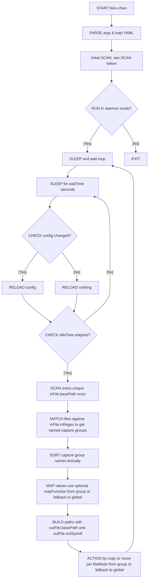

# fairu-chan

[](https://github.com/justinnamilee/fairu-chan/releases)
[](LICENSE)

*Your friendly neighborhood file-sorting demon—now with more brimstone.*

---

## ⚡ Features (aka “What magic does this little script pull?”)

* **Regex-fu input**: Slurp up filenames with regex ninja moves. No black belts required, but maybe some jutsu.
* **Printf-style output**: Specify the output (paths and filenames) based on your ninja regex matches.
* **Custom mapping spells**: Conjure up capture-group transformations with your own Perl incantations (subroutines) between input and output.
* **Run Modes**:
  * **Dry-Run mode**: Peek behind the curtain without touching your files. Because curiosity shouldn’t wreck havoc.
  * **Single-shot mode**: Actually do something, but only the once. Use after validating with Dry-Run mode.
  * **Daemon mode**: Lives in the shadows, constantly stalking your ingest folders and pouncing on new files.  Use once comfy.
* **Auto-reload**: Change your YAML, and fairu-chan reloads faster than you can spill coffee on your keyboard (requires `File::Monitor`).
* **Signal handling**: Send UNIX voodoo (`SIGUSR1`, `SIGUSR2`, `SIGTERM`, `SIGINT`) for graceful events:
  * `SIGUSR1` will cause it to scan immediately on next checkin.
  * `SIGUSR2` will cause it to reload the config then scan on next checkin.
  * `SIGTERM` will cause a graceful shutdown after next action finishes.
  * `SIGINT` will ungracefully murder the demon.
* **Notifications**:
  * Brag to your Discord server every time it sorts something—“fairu-chan processed a file, *praise be*!”
  * Send partial scan notices to your Plex server, for cool CIFS/NFS users.

---

## 🔄 Flow

### One Heck of a Diagram



### In Words Instead of a Diagram

1. **Initialization**
   On startup, `fairu-chan` parses the command-line arguments and loads the YAML config (exiting on parse/validation failure).
2. **Initial scan**
   It immediately calls the scanner, which gathers files, matches them to your regex rules, and builds an input→output map.
3. **Daemon loop**
   If you ran in `daemon` mode, it then:

   * Sleeps in `waitTime`-second increments
   * On each wake: checks for config changes (reloads if needed) and decrements an internal `idle` counter
   * When the counter hits zero (i.e. after `idleTime` seconds), triggers another full scan and resets the counter.
4. **File discovery**
   Directories (recursively if enabled) are scanned via `scanFiles` to build a flat list of candidates.
5. **Pattern matching**
   Each filename is tested against every grouping’s `inRegex`; if more than one matches, the `precedence` rules decide which wins.
6. **Path computation**
   For each match, an output path is computed by joining the group’s `outFile.basePath` with a `sprintf` of your named capture groups (applying any `mapFunction`s).
7. **Processing**
   If running (`run` action), the script creates any missing directories and then either `move`s or `copy`s each file according to `fileMode`.
8. **Notifications**
   After processing each file it sends an “event” notification (e.g. Discord); when the run finishes it sends a “debug” summary.
9. **Signals & shutdown**
   While daemonized it listens for:

   * `SIGTERM`: graceful shutdown after current work
   * `SIGUSR1`: force a scan on next cycle
   * `SIGUSR2`: reload config immediately
   * `SIGINT`: immediate exit (bad)

---

## 🛠 Requirements (aka “Because nothing’s free, not even in open source”)

* Required CPAN modules:

  * `YAML::PP` (for your crystal-ball config)

* Optional CPAN Modules (config-dependent):

  * `File::Monitor` (for auto-reload magic)
  * `WebService::Discord::Webhook`, `IO::Socket::SSL`, `Data::Validate::URI` (to shout at Discord)
  * `URI::Escape`, `HTTP::Tiny`, `Data::Validate::URI` (to force-scan Plex folders)

* Likely Built-In Modules (probably don't need to install them)

  * `File::Copy`, `File::Path`, `File::Spec` (basic file sorcery)

---

## 🚀 Installation (aka “Let the ritual begin”)

```bash

git clone https://github.com/justinnamilee/fairu-chan.git  # probably pick the latest tagged version
cd fairu-chan
cp fairu-chan /usr/local/bin/  # or wherever you stash your secret tools
chmod +x /usr/local/binfairu-chan
```

---

## 🎩 Usage (aka “Press the big red button”)

```bash

# Peek at what’ll happen (dry-run):
perl fairu-chan /path/to/config.yml

# One-shot tidy-up:
perl fairu-chan /path/to/config.yml run

# Become a background lurker (daemon mode):
perl fairu-chan /path/to/config.yml daemon
```

---

## 📝 Configuration (aka “Feed me YAML, baby”)

Craft a YAML file with two main sections: `meta` (global voodoo settings, *optional*) and `data` (your file-slaying rules, *required*), like so:

```yaml

meta:
  autoreload: true
  recurse: false
  idleTime: 300
  waitTime: 5
  notification:
    discord:
      type: discord
      webhookUrl: "https://discord.com/api/webhooks/…"
      template: "fairu-chan just added `%s`! *chef’s kiss*"
      for: event

data:
  Pictures:
    fileMode: move
    inFile:
      basePath: "/mnt/ingest/photos"
      recurse: true
      inRegex: "IMG_(?<date>\\d{4}-\\d{2}-\\d{2})_(?<num>\\d+)\\.jpg"
    outFile:
      basePath: "/mnt/media/Photos"
      outSprintf: "%{date}/photo_%05d.jpg"
```

### *Full sample config with commentary: See [`sample-conf.yml`](sample-conf.yml) for the guided tour.*

---

## ⚙️ Systemd Service Example (aka “Turn it into a real daemon”)

Save [`sample-service.service`](sample-service.service) to `/etc/systemd/system/`:

```bash

cp sample-service.service /etc/systemd/system/fairu-chan.service
systemctl daemon-reload
systemctl enable fairu-chan
systemctl start fairu-chan
```

---

## 🤝 Contributing (aka “Join the coven”)

1. Fork it, or whatever
2. Create a branch: `git checkout -b feat/my-awesome-spell`
3. Commit your sorcery: `git commit -m "Add feature X"`
4. Push it: `git push origin feat/my-awesome-spell`
5. Open a PR and await divine feedback

> *Please stick to the existing Perl arcana (AKA the obtuse formatting).*

---

## 📜 License

Licensed under **GPL-3.0**. See [LICENSE](LICENSE) for the fine print (it’s not *that* scary, promise).
