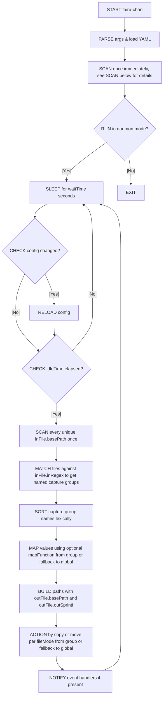

# fairu-chan

[](https://github.com/justinnamilee/fairu-chan/releases)
[](LICENSE)

*Your friendly neighborhood file-sorting demon—now with more brimstone.*

---

## ⚡ Features (aka “What magic does this little script pull?”)

* **Regex-fu input**: Slurp up filenames with regex ninja moves. No black belts required, but maybe some jutsu.
* **Printf-style output**: Specify the output (paths and filenames) based on your ninja regex matches.
* **Custom mapping spells**: Conjure up capture-group transformations with your own Perl incantations (subroutines) between input and output.
* **Run Modes**:
  * **Dry-Run mode**: Peek behind the curtain without touching your files. Because curiosity shouldn’t wreck havoc.
  * **Single-shot mode**: Actually do something, but only the once. Use after validating with Dry-Run mode.
  * **Daemon mode**: Lives in the shadows, constantly stalking your ingest folders and pouncing on new files.  Use once comfy.
* **Auto-reload**: Change your YAML, and fairu-chan reloads faster than you can spill coffee on your keyboard (requires `File::Monitor`).
* **Signal handling**: Send UNIX voodoo (`SIGUSR1`, `SIGUSR2`, `SIGTERM`, `SIGINT`) for graceful events:
  * `SIGUSR1` will cause it to scan immediately on next checkin.
  * `SIGUSR2` will cause it to reload the config then scan on next checkin.
  * `SIGTERM` will cause a graceful shutdown after next action finishes.
  * `SIGINT` will ungracefully murder the demon.
* **Notifications**:
  * Brag to your Discord server every time it sorts something—“fairu-chan processed a file, *praise be*!”
  * Send partial scan notices to your Plex server, for cool CIFS/NFS users.

---

## 🔄 Flow (aka “What the heck does it do?”)



---

## 🛠 Requirements (aka “Because nothing’s free, not even in open source”)

* Required CPAN modules:

  * `YAML::PP` (for your crystal-ball config)

* Optional CPAN Modules (config-dependent):

  * `File::Monitor` (for auto-reload magic)
  * `WebService::Discord::Webhook`, `IO::Socket::SSL`, `Data::Validate::URI` (to shout at Discord)
  * `URI::Escape`, `HTTP::Tiny`, `Data::Validate::URI` (to force-scan Plex folders)

* Likely Built-In Modules (probably don't need to install them)

  * `File::Copy`, `File::Path`, `File::Spec`, `File::Basename` (basic file sorcery)

---

## 🚀 Installation (aka “Let the ritual begin”)

```bash

curl -L https://cpanmin.us | perl - -M https://cpan.metacpan.org -n YAML::PP
cd /opt
git clone https://github.com/justinnamilee/fairu-chan.git  # probably pick the latest tagged version
cd fairu-chan
cp sample-service.service /etc/systemd/system/fairu-chan.service
systemctl daemon-reload
touch /etc/fairu-chan.yml  # edit this file the way you want
```

---

## 🎩 Usage (aka “Press the big red button”)

```bash

# Peek at what’ll happen (dry-run):
perl fairu-chan /etc/fairu-chan.yml

# One-shot tidy-up:
perl fairu-chan /etc/fairu-chan.yml run

# Become a background lurker (daemon mode):
perl fairu-chan /etc/fairu-chan.yml daemon
```

---

## 📝 Configuration (aka “Feed me YAML, baby”)

Craft a YAML file with two main sections: `meta` (global voodoo settings, *optional*) and `data` (your file-slaying rules, *required*), like so:

```yaml

meta:
  autoreload: true
  recurse: false
  idleTime: 300
  waitTime: 5
  notification:
    discord:
      type: discord
      webhookUrl: 'https://discord.com/api/webhooks/…'
      template: 'fairu-chan just added `%s`! *chef’s kiss*'
      for: event

data:
  Pictures:
    fileMode: move
    inFile:
      basePath: '/mnt/ingest/photos'
      recurse: true
      inRegex: 'IMG_(?<date>\\d{4}-\\d{2}-\\d{2})_(?<num>\\d+)\\.jpg'
    outFile:
      basePath: '/mnt/media/Photos'
      outSprintf: '%{date}/photo_%05d.jpg'
```

### *Full sample config with commentary: See [`sample-conf.yml`](sample-conf.yml) for the guided tour.*

---

## ⚙️ Systemd Service Example (aka “Turn it into a real daemon”)

Save [`sample-service.service`](sample-service.service) to `/etc/systemd/system/`:

```bash

cp sample-service.service /etc/systemd/system/fairu-chan.service
systemctl daemon-reload
systemctl enable fairu-chan
systemctl start fairu-chan
```

---

## 🤝 Contributing (aka “Join the coven”)

1. Fork it, or whatever
2. Create a branch: `git checkout -b feat/my-awesome-spell`
3. Commit your sorcery: `git commit -m "Add feature X"`
4. Push it: `git push origin feat/my-awesome-spell`
5. Open a PR and await divine feedback

> *Please stick to the existing Perl arcana (AKA the obtuse formatting).*

---

## 📜 License (aka "...License")

Licensed under **GPL-3.0**. See [LICENSE](LICENSE) for the fine print (it’s not *that* scary, promise).

---

## 🔒 Secret Bonus (aka "Shhhh")

### Here's One to Figure Out for You

```yaml

data:
  anime:
    fileMode: copy
    mapFunction:
      b: 'my ($b) = @_; if ($b =~ / S(\d+) - (\d+)/) { my $e = sprintf(q[ - S%02dE%02d], $1, $2); $b =~ s/ S\d+ - \d+/$e/ } return ($b)'
    inFile:
      recurse: true
      basePath: /home/user/Downloads
      inRegex: '(?<b>\[(?:[^\]].+?])\] (?<a>.+?)(?:\.+)?(?: S\d+)? - \d+(?i: ?v\d+)?(?i: END)?(?: (?:\(|\[).+?)?\.mkv)$'
    outFile:
      basePath: '/mnt/netmount/multimedia/Television'
      # A has the directory, B is the file name
      outSprintf: '%s/%s'
```

### The Mysterious Bin Folder

* Contains the (still maintained) script that inspired `fairu-chan`, the aptly named `rename` script.
* Useful if you need to do stuff one-off and don't want to write YAML.
* It has POD in the file / help if you'd like to use it, works much the same way as `fairu-chan` (go figure).
* Still use it a few times a week myself even while `fairu-chan` does the heavy-lifting for the automated content.
